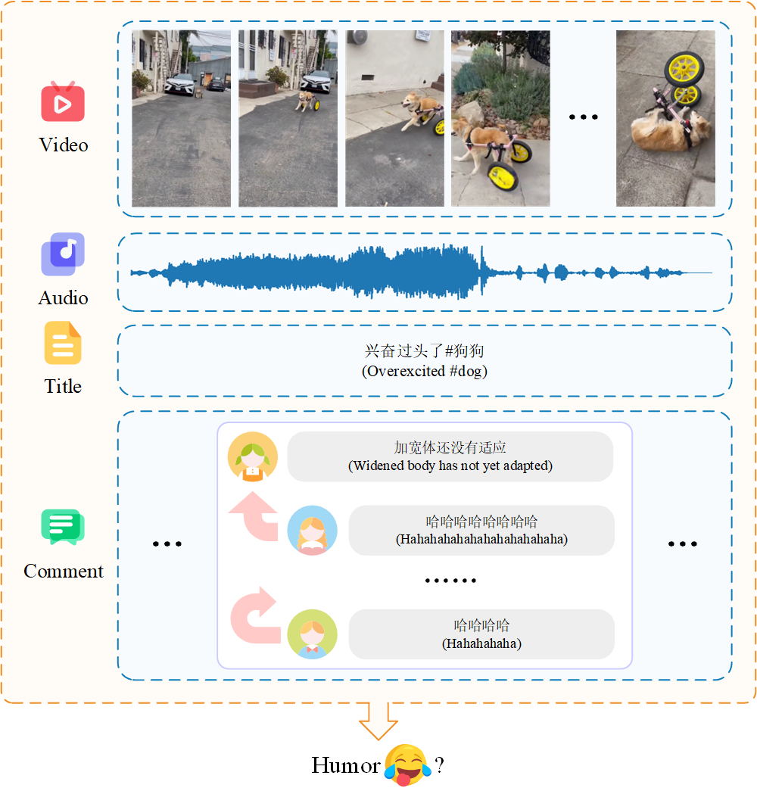
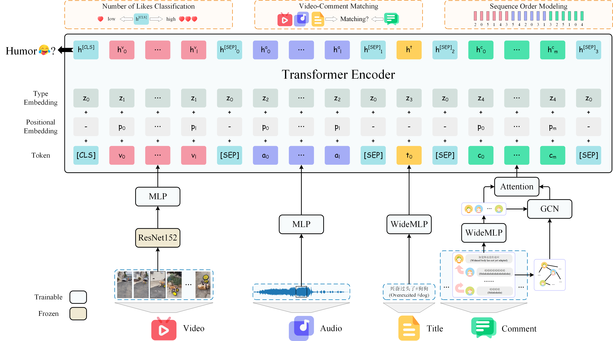

# 🎬 Comment-aware Multi-modal Heterogeneous Pre-training for Humor Detection in Short-form Videos

[Comment-aware Multi-modal Heterogeneous Pre-training for Humor Detection in Short-form Videos](https://ebooks.iospress.nl/doi/10.3233/FAIA230438)

[Yang Liu](https://yliu-cs.github.io), Huanqin Ping, Dong Zhang, Qingying Sun, Shoushan Li and Guodong Zhou

<p>
  
  
</p>

Conventional humor analysis normally focuses on text, text-image pair, and even long video (e.g., monologue) scenarios. However, with the recent rise of short-form video sharing, humor detection in this scenario has not yet gained much exploration. To the best of our knowledge, there are two primary issues associated with short-form video humor detection (SVHD): 1) At present, there are no ready-made humor annotation samples in this scenario, and it takes a lot of manpower and material resources to obtain a large number of annotation samples; 2) Unlike the more typical audio and visual modalities, the titles (as opposed to simultaneous transcription in the lengthy film) and associated interactive comments in short-form videos may convey apparent humorous clues. Therefore, in this paper, we first collect and annotate a video dataset from DouYin (aka. TikTok in the world), namely DY24h, with hierarchical comments. Then, we also design a novel approach with comment-aided multi-modal heterogeneous pre-training (CMHP) to introduce comment modality in SVHD. Extensive experiments and analysis demonstrate that our CMHP beats several existing video-based approaches on DY24h, and that the comments modality further aids a better comprehension of humor. Our dataset, code and pre-trained models are available here.

## 🎮 DY24h Dataset

> DY24h dataset will be released soon later !

## 🏠 Code Structure

```
├── data
│   ├── __init__.py
│   ├── load.py
│   ├── dataset.py
├── dataset
│   ├── labeled
│   │   ├── train
│   │   │   ├── 6629498405498391822
│   │   │   ├── ......
│   │   │   └── 7125060654800669956
│   │   ├── val
│   │   │   ├── 6557952865950764295
│   │   │   ├── ......
│   │   │   └── 7125389644388125965
│   │   └── test
│   │   │   ├── 6566049165850184964
│   │   │   ├── ......
│   │   │   └── 7125604273223716109
│   └── unlabeled
│       ├── 7089340037875158310
│       ├── ......
│       └── 7130855778214300962
├── models
│   ├── __init__.py
│   ├── embedding.py
│   ├── encoder.py
│   ├── graph.py
│   ├── model.py
├── plot
│   ├── __init__.py
│   ├── acc_cmp.py
│   ├── attention.py
│   ├── comment.py
│   ├── duration.py
│   ├── intro.py
│   ├── like_comment.py
│   ├── loss_acc.py
│   ├── pretrain_loss.py
│   ├── scheme.py
│   └── tSNE.py
├── utils
│   ├── __init__.py
│   ├── config.py
│   ├── metrics.py
│   └── misc.py
├── extract.py
├── pretrain.py
├── finetune.py
├── requirements.txt
└── README.md
```

## ⚙️ Installation

```sh
git clone https://github.com/yliu-cs/CMHP.git
cd CMHP

conda create -n CMHP python=3.8
pip install torch==1.12.1+cu116 torchvision==0.13.1+cu116 torchaudio==0.12.1 --extra-index-url https://download.pytorch.org/whl/cu116
pip install -r requirements.txt
```

## 🚀 Usage

```sh
# Data Preprocessing
python extract.py

# Pre-Training
python pretrain.py

# Fine-Tuning
python finetune.py
```

> Pre-trained model will be released soon later !

## 📧 Contact

For any questions or feedback, feel free to contract [Yang Liu](mailto:yliu.cs.cn@gmail.com) or create an issue in this repository.

## 📜 Citation

If you find DY24h or CMHP useful in your research or applications, please kindly cite:

```bibtex
@inproceedings{conf/ecai/LiuPZSLZ23,
  author       = {Yang Liu and
                  Huanqin Ping and
                  Dong Zhang and
                  Qingying Sun and
                  Shoushan Li and
                  Guodong Zhou},
  editor       = {Kobi Gal and
                  Ann Now{\'{e}} and
                  Grzegorz J. Nalepa and
                  Roy Fairstein and
                  Roxana Radulescu},
  title        = {Comment-Aware Multi-Modal Heterogeneous Pre-Training for Humor Detection
                  in Short-Form Videos},
  booktitle    = {{ECAI} 2023 - 26th European Conference on Artificial Intelligence,
                  September 30 - October 4, 2023, Krak{\'{o}}w, Poland - Including
                  12th Conference on Prestigious Applications of Intelligent Systems
                  {(PAIS} 2023)},
  series       = {Frontiers in Artificial Intelligence and Applications},
  volume       = {372},
  pages        = {1568--1575},
  publisher    = {{IOS} Press},
  year         = {2023},
  url          = {https://doi.org/10.3233/FAIA230438},
  doi          = {10.3233/FAIA230438},
  timestamp    = {Wed, 18 Oct 2023 09:31:16 +0200},
  biburl       = {https://dblp.org/rec/conf/ecai/LiuPZSLZ23.bib},
  bibsource    = {dblp computer science bibliography, https://dblp.org}
}
```
